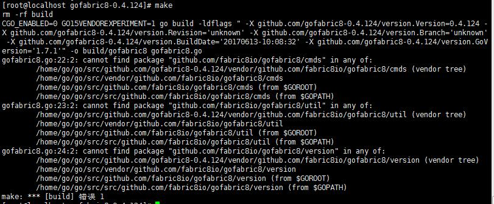

# fabric8安装
### 环境路径

```
centos 7
```
 
默认安装路径：

```
/home
```
---

### 安装golang
golang默认安装在目录：
```
/home/go
```
1. 从golang[官网](https://golang.org/dl/)获取最新golang包，此处获取 go1.8.3.linux-amd64.tar.gz，使用命令：
```
wget https://storage.googleapis.com/golang/go1.8.3.linux-amd64.tar.gz
```
进行获取
2. 将golang解压，使用命令：

```
tar -zxvf go1.8.3.linux-amd64.tar.gz
```
3. 配置环境变量，使用命令
```
vi /etc/profile
```
并在profile末尾添加

```
export GOROOT=/home/go/go  
export GOBIN=$GOROOT/bin  
export PATH=$PATH:$GOBIN  
export GOPATH=$GOROOT/src
```

### 安装fablic8
fabric8默认安装在目录：
```
/home/fabric8
```
1. 从fabric8的github[官网](https://github.com/fabric8io/gofabric8/releases)获取fabric8的可执行包或源码（国内下可执行包的地址被墙），此处下载源码 [Source code (tar.gz)](https://codeload.github.com/fabric8io/gofabric8/tar.gz/v0.4.131)
2. 解压源码，使用命令：

```
wget gofabric8-0.4.124.tar.gz
```
3. 由于是go源码，所以需要把解压后的文件夹放置在GOPATH下，使用命令：

```
tar -zxvf gofabric8-0.4.124.tar.gz
mv gofabric8-0.4.124 $GOPATH
```
4. 进入gofabric8文件夹，执行：

```
make
```
即可  
==注意：当执行make指令时，会报go不存在的错误，

这是由于没有执行export操作后没有执行==

```
source /etc/profile
```
==的缘故==


